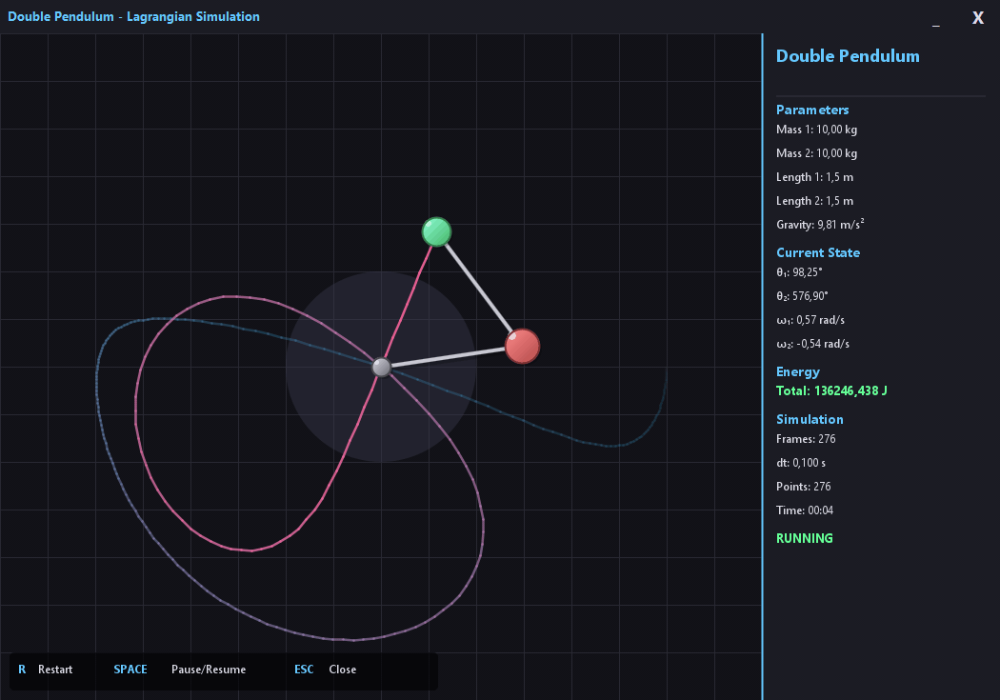

# Double Pendulum Simulation
This repository contains a simulation of a double pendulum system using Java and solved these equations by Euler-Lagrange differential equation.

## Overview
A double pendulum consists of two pendulums attached end to end. The motion of a double pendulum is chaotic and highly sensitive to initial conditions, making it a fascinating subject for study in physics and mathematics.



## Modeling

### System Description

The double pendulum consists of two point masses connected by massless rods:
- **Mass 1 (m₁)**: Connected to a fixed pivot point
- **Mass 2 (m₂)**: Connected to the end of the first pendulum
- **Length 1 (L₁)**: Length of the first rod
- **Length 2 (L₂)**: Length of the second rod
- **Gravity (g)**: Gravitational acceleration

### Coordinate System

The system uses angular coordinates:
- **θ₁**: Angle of the first pendulum from vertical (downward)
- **θ₂**: Angle of the second pendulum from vertical (downward)
- **ω₁ = θ̇₁**: Angular velocity of the first pendulum
- **ω₂ = θ̇₂**: Angular velocity of the second pendulum

### Position of the Masses

The Cartesian coordinates of each mass are derived from the angular positions:

**Mass 1:**
```
x₁ = L₁ sin(θ₁)
y₁ = -L₁ cos(θ₁)
```

**Mass 2:**
```
x₂ = L₁ sin(θ₁) + L₂ sin(θ₂)
y₂ = -L₁ cos(θ₁) - L₂ cos(θ₂)
```

### Velocities

Taking the time derivative of the positions, we get the velocities:

**Mass 1:**
```
ẋ₁ = L₁ ω₁ cos(θ₁)
ẏ₁ = L₁ ω₁ sin(θ₁)
```

**Mass 2:**
```
ẋ₂ = L₁ ω₁ cos(θ₁) + L₂ ω₂ cos(θ₂)
ẏ₂ = L₁ ω₁ sin(θ₁) + L₂ ω₂ sin(θ₂)
```

The speed squared for each mass:
```
v₁² = ẋ₁² + ẏ₁² = L₁² ω₁²
v₂² = ẋ₂² + ẏ₂² = L₁² ω₁² + L₂² ω₂² + 2L₁L₂ ω₁ω₂ cos(θ₁ - θ₂)
```

### Lagrangian Formulation

The Lagrangian (L) is defined as the difference between kinetic energy (T) and potential energy (V):

```
L = T - V
```

**Kinetic Energy:**
```
T = ½ m₁ v₁² + ½ m₂ v₂²
T = ½ m₁ L₁² ω₁² + ½ m₂ [L₁² ω₁² + L₂² ω₂² + 2L₁L₂ ω₁ω₂ cos(θ₁ - θ₂)]
```

**Potential Energy:**
```
V = m₁ g y₁ + m₂ g y₂
V = -m₁ g L₁ cos(θ₁) - m₂ g [L₁ cos(θ₁) + L₂ cos(θ₂)]
```

**Complete Lagrangian:**
```
L = ½(m₁ + m₂)L₁² ω₁² + ½ m₂ L₂² ω₂² + m₂ L₁ L₂ ω₁ω₂ cos(θ₁ - θ₂)
    + (m₁ + m₂) g L₁ cos(θ₁) + m₂ g L₂ cos(θ₂)
```

### Euler-Lagrange Equations

The equations of motion are derived from the Euler-Lagrange equation:

```
d/dt(∂L/∂θ̇ᵢ) - ∂L/∂θᵢ = 0
```

For our system with two degrees of freedom (θ₁ and θ₂), we get two coupled differential equations.

After applying the Euler-Lagrange equations and simplifying, we obtain the angular accelerations:

**Angular Acceleration of θ₁:**
```
         -g(2m₁ + m₂)sin(θ₁) - m₂g sin(θ₁ - 2θ₂) - 2sin(θ₁ - θ₂)m₂[ω₂²L₂ + ω₁²L₁cos(θ₁ - θ₂)]
θ̈₁ = ───────────────────────────────────────────────────────────────────────────────────────────
                            L₁[2m₁ + m₂ - m₂cos(2θ₁ - 2θ₂)]
```

**Angular Acceleration of θ₂:**
```
         2sin(θ₁ - θ₂)[ω₁²L₁(m₁ + m₂) + g(m₁ + m₂)cos(θ₁) + ω₂²L₂m₂cos(θ₁ - θ₂)]
θ̈₂ = ─────────────────────────────────────────────────────────────────────────────────
                         L₂[2m₁ + m₂ - m₂cos(2θ₁ - 2θ₂)]
```

### Numerical Integration

The simulation uses **Euler's method** for numerical integration:

1. **Calculate accelerations** using the Euler-Lagrange equations at time t:
   ```
   α₁ = θ̈₁(θ₁, θ₂, ω₁, ω₂)
   α₂ = θ̈₂(θ₁, θ₂, ω₁, ω₂)
   ```

2. **Update angular velocities**:
   ```
   ω₁(t + Δt) = ω₁(t) + α₁ · Δt
   ω₂(t + Δt) = ω₂(t) + α₂ · Δt
   ```

3. **Update angles**:
   ```
   θ₁(t + Δt) = θ₁(t) + ω₁(t + Δt) · Δt
   θ₂(t + Δt) = θ₂(t) + ω₂(t + Δt) · Δt
   ```

Where:
- **Δt** is the time step (smaller values = more accurate but slower)
- **α₁, α₂** are the angular accelerations
- **ω₁, ω₂** are the angular velocities (θ̇₁, θ̇₂)
- **θ₁, θ₂** are the angles

### Understanding the Derivatives

In the Lagrangian formulation:

- **θ**: Position (angle) - describes *where* the pendulum is
- **θ̇ (omega, ω)**: First derivative - describes *how fast* the angle is changing (angular velocity)
- **θ̈ (alpha, α)**: Second derivative - describes *how fast* the velocity is changing (angular acceleration)

The relationship:
```
θ̇ = dθ/dt  (velocity is the rate of change of position)
θ̈ = dω/dt = d²θ/dt²  (acceleration is the rate of change of velocity)
```

### Energy Conservation

In an ideal system with no friction, the total energy should remain constant:

```
E = T + V = constant
```

The simulation tracks energy to verify numerical accuracy. Small energy drift over time indicates numerical errors from the integration method.

## Algorithm Implementation

The core algorithm in the `Lagrange.java` class follows these steps:

1. **`calculateAccelerations()`**: Computes θ̈₁ and θ̈₂ from the current state
2. **`integrate()`**: Updates the system state using Euler's method
3. **`calculateEnergy()`**: Computes total energy for verification
4. **`calculateLagrangian()`**: Computes L = T - V for analysis

The simulation loop:
```
for each time step:
    1. Calculate accelerations from current angles and velocities
    2. Update velocities using accelerations
    3. Update angles using new velocities
    4. Draw the pendulum at new position
    5. Record trajectory
```

## Features

- Real-time visualization of the double pendulum motion
- Trajectory tracking showing the path of the second mass
- Energy and Lagrangian value display
- Pause/resume functionality
- Adjustable simulation parameters
- Custom dark-themed UI

## Usage

Run the simulation with custom parameters:
```bash
java -jar lagrange-double-pendulum.jar --theta1=90 --theta2=45 --m1=10 --m2=10 --L1=150 --L2=150 --g=9.81
```

Or use a configuration file:
```bash
java -jar lagrange-double-pendulum.jar --config=myconfig.txt
```

### Controls
- **ESC**: Pause/Resume simulation
- **R**: Reset to initial conditions
